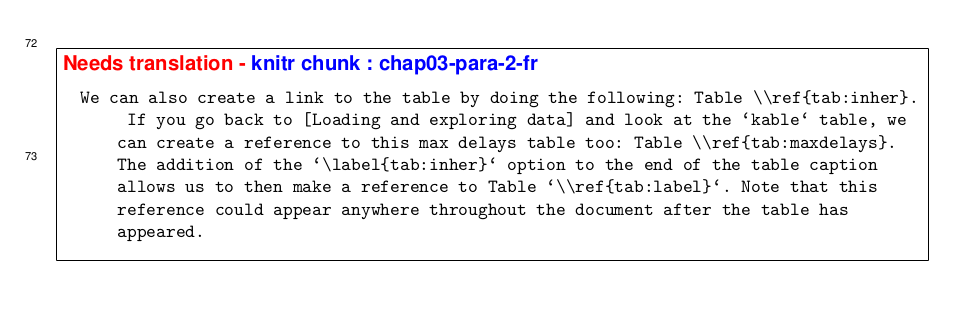

\hypersetup{
  colorlinks = false,
  linkbordercolor = blue,
  pdfborderstyle = {/S/U/W 0.5} % underline of width 0.5pt
}

```{=latex}
% Needed to set the section numbers to start at 1 instead of zero
\setcounter{section}{1}
```

```{r, include = FALSE}
knitr::opts_chunk$set(
  collapse = TRUE,
  comment = "#>"
)
```

```{r setup, echo = FALSE, message = FALSE, results = "hide", warning = FALSE}
library(csasdowntex)
```

_______________________________________________________________________

## Introduction

Translating ***csasdowntex*** documents from English to French has been performed in an ad-hoc fashion up to this point. There is now a method to do this which is built into the ***csasdowntex*** package.

Methods used to date include:

1. Send the English version in for translation to government translators. Once it comes back, create a second document directory containing a complete copy of the English document source, then modify the English paragraphs to be French based on what is written in the translated document and change the Figures and Tables into French versions.

2. Compile the English version as a Microsoft Word document and then send it for translation to official government translation services. Include French Figures and Tables in this version and submit the translated document as a Microsoft Word document to CSAS for publication.

There are several issues with these methods:

1. Creating a second document directory with entirely separate code for the French document is prone to error. Typically, the French document directory is created once the English one has been finalized by copy/pasting the entire English directory and then pasting the French translations on a paragraph-by-paragraph basis into the source code files. However, it is common for there to be some changes needed to the assessment after the French directory has been created, leading to the authors having to attempt to manually sync the English and French versions with the new changes.

2. Sending a Word document out for translation poses several problems including re-generation of all plots and tables in French in a non-standardized way, and quality of the French document not being at the same level as that of the English document. The two documents will not appear the same in formatting and are of two different file types. There is also the possibility that the French terms used on the figures/Tables pre-made by the authors are found to be incorrect by the official translators, which would lead to further editing of Figures/Tables. If Figures or Tables are created manually and cut/pasted into the document, it will break the reproducibility.

Reproducibility should be taken into account where possible. If the stock is to be assessed again, it would save the authors a lot of time to have a document reproducible in both English and French.

The method presented here and which is built into the ***csasdowntex*** package ensures that you have one single document which is compile-able in both English and French, with a toggle found in the YAML header. This requires manual cut-and-paste translation using an online translation tool. One such tool is [**DeepL**](https://www.deepl.com/en/translator), but there are many.

## Overview of the method

In a normal (English-only) Rmarkdown document, you write paragraphs directly as text in the Rmarkdown source files (**\*.Rmd** or **\*.rmd** files). To have document source which can be compiled in either language, there must be knitr chunks containing either English or French paragraphs, which can be toggled on or off using a global variable. There will be two chunks for each paragraph, one for English and one for French. The text itself will be placed within `cat()` function calls in the chunks (Section \@ref(sec:from-scratch)).

To make the document easily switchable from one language to the other, ***csasdowntex*** will parse the applicable chunks as paragraph text. This means that you will write text inside knitr code chunks within `cat()` function calls. There will be two chunks for each paragraph, one containing the English paragraph and one containing the French paragraph. You do not have to make any modifications to the way you render documents with these special chunks, ***csasdowntex*** will do it automatically when you run the `csasdowntex::render()` command.

## UTF-8 Encoding setup {#sec:utf8}

Your project ***must*** be set up to use UTF-8 encoding. Often, editors are by default set to save using ASCII only, which does not support international alphabet characters.

To set up Rstudio using UTF-8 mode, see the directions on [**this page**](https://support.posit.co/hc/en-us/articles/200532197-Character-Encoding-in-the-RStudio-IDE) and click the check box **Set as default encoding for source files**.

You can now paste the French text exactly as it is translated into the source files (**\*.Rmd**, **\*.rmd** and **\*.r** files). You do not need to and should not use escape sequences for special French characters. If you are doing so, or using escape sequences for any other special characters, you will encounter all sorts of errors as you progress.

If you are using an editor other than RStudio, you will need to look up how to make sure all new files you create in your editor are UTF-8 compatible, and ensure that saving over a file already in UTF-8 does not revert it back to ASCII.

## Required YAML settings

If you used the **resdoc-b** example document as a starting point, all additional French settings were already set up for you. They will have to be modified to match your project. If you are starting with an old project, you will have to add these tags in the YAML code, in the `index.rmd` file.

YAML tags you need to set up for French compilation:

- `french_title` - French translation of the `title` tag

- `french_address` - French translation of the `address` tag. It is the address(es) of the author's workplace(s). Use carets around digits on a new line to create individual addresses. See this example which shows two addresses:

``` yaml
french_address: |
  ^1^Station biologique du Pacifique\
     Pêches et Océans Canada, 3190 Hammond Bay Road\
     Nanaimo, Colombie-Britannique, V9T 6N7, Canada\
  \smallskip
  ^2^Loin, très loin\
     Une autre galaxie
```

- `french_month` - French translation of the `month` tag, for example "Décembre"

- `french_region` - French translation of the `region` tag, for example "Région du Pacifique"

- `french_abstract` - French translation of the abstract as found in the `abstract` tag

If any of these are missing, you will receive an Error message as follows (using the `french_address` and `french_region` tags as an example):

  > Error: ✖ Your index.Rmd file is missing the YAML tag(s):

  > `french_address`
  
  > `french_region`

## Creating a bilingual project from scratch {#sec:from-scratch}

If you are creating a document from scratch, and not basing it on an older ***csasdowntex*** document (one based on the **resdoc** draft example), use the **resdoc-b** draft of ***csasdowntex*** as it contains both English and French example chunks already set up to start you off. To do that, run `csasdowntex::draft(“resdoc-b”)` in an empty directory.

To have a French compile-able document You ***must*** use `cat()` statements inside all knitr chunks (both English and French) in the **\*.Rmd** or **\*.rmd** files. All English chunks must have a name that ends in **-en**. They must also contain `eval = !fr()` as in the following example:

````{verbatim}
```{r length-data-en, eval = !fr(), results = 'asis'}
cat("### Length data

Paragraphs on length data go here.

")
```
````

The corresponding French chunk ***must*** have the same root name (**length-data** in this case) but end in **-fr** instead of **-en**. They must also contain `eval = fr()` and either `needs_trans = TRUE` or `needs_trans = FALSE` as shown in the following chunk example:

````{verbatim}
```{r length-data-fr, eval = fr(), results = 'asis', needs_trans = FALSE}

cat(“### Données de longueur

Les paragraphes sur les données de longueur se trouvent ici.

“)
```
````

If you name the chunks correctly (ending in `-en` or `-fr`) but forget the `eval` or `needs_trans` variables, you will receive an error. If you include the variables `eval = fr()`, `eval = !fr()` or `needs_trans` but do not name the chunks correctly, you will also receive an error.

In the **resdoc-b** example document, the French chunks contain ***mirror references*** inside them which are just special labels telling the compiler to paste a verbatim copy of the chunk contents found in the chunk referred to in the label. In this example, the ***mirror references*** is given by `<<length-data-en>>` and the contents of the knitr chunk with the label `length-data-en` will replace it. The above French chunk with a mirror reference to its English counterpart looks like this:

````{verbatim}
```{r length-data-fr, eval = fr(), results = 'asis', needs_trans = TRUE}

­<<length-data-en>>
```
````

In an output French PDF document, any French chunks which have not yet been translated by you (have chunk option `needs_trans = TRUE`) will have a black border placed around them with a red label stating **Needs translation**, a blue label stating the knitr chunk name that needs translation, and the text currently found inside the chunk. This is to draw attention to it in the document when you go through it after building it. The following image shows an example of this.

```{r figure-example-needs-trans, echo = FALSE, out.width = "6in"}

```

Once you translate a paragraph to French, remove any and all contents of the corresponding French chunk if any (such as ***mirror references***), and place a `cat("")` statement inside it, then paste the translated French version of text between the quotes of the `cat("")` statement. Newlines are allowed and required for newlines in the document to appear. Change the knitr chunk option `needs_trans` to `FALSE`. If you forget to change `needs_trans` to `FALSE` you will receive a warning during compilation.

Compile often, as errors can occur due to the translation and it is much easier to fix these as you go, instead of at the end.

**Notes:**

- your project has to be set up to use UTF-8 encoding. See Section \@ref(sec:utf8)

- the knitr chunk option `needs_trans` is only needed in the French chunks and must be `TRUE` until the translation is complete and has been pasted into the chunk. Once you paste the French translation in, you must change `needs_trans` to `FALSE`. If you put the `needs_trans` option into an English chunk, the compiler will tell you that it is unnecessary and remove it for you in the intermediate compilation files. To get rid of the warning, remove it manually from the source chunk.

- the chunks have their `eval` value dependent on the value of the `csasdowntex::fr()` function. This means English chunks will be ignored if `fr()` returns `TRUE` and French chunks will be ignored if `fr()` returns `FALSE`. The `fr()` function simply returns the value of the R option `french` like this: `getOption("french", default = FALSE)`. For English chunks the value must be set to `eval = !fr()` and for French it must be `eval = fr()`.

- the `french` option is set by the YAML tag `french: true` or `french: false` in the **index.Rmd** file. You can also set the french option manually if you are debugging by entering `options(french = TRUE)`.

## Creating a bilingual project from an older csasdowntex project

Make sure you have read and understand Section \@ref(sec:from-scratch) first. To convert an older `csasdowntex` project into a bilingual project, you must create two chunks for each paragraph in every **\*.Rmd** or **\*.rmd** file, with the size of a "paragraph" being whatever you are comfortable with. You can make it ten actual paragraphs long per chunk if you want, but keep in mind that the translation sites typically have a limit of so many characters you can translate at one time, and may ***not tell you*** that it truncated your translation if it meets this limit. **DeepL** for example allows 500 characters maximum to be translated at a time and will not tell you that it truncated your text if you provided over 500 characters. For this reason it is a good idea to keep the chunk sizes down below 500 characters and if you think it's close, check the end of your translation to make sure it has not been truncated.

Use chunks in the **resdoc-b** document example to create your English and French chunks. A basic example is [**here**](https://github.com/pbs-assess/csasdowntex/blob/f2348defb570006e29db00f2812c5f771ac42516/inst/rmarkdown/templates/resdoc-b/skeleton/01-chap1.Rmd#L1-L12).

You must have project-wide unique chunk names, as with any Rmarkdown project. You can come up with a naming convention, or just have the names for each paragraph within a section in a numerical sequence like the following, but they must end in `-en` and `-fr` for English and French chunks respectively:

For the English chunks in "chapter 1":

> `chap01-para-1-en`, `chap01-para-2-en`, `chap01-para-3-en`, etc.

and the French chunks in "chapter 1":

> `chap01-para-1-fr`, `chap01-para-2-fr`, `chap01-para-3-fr`, etc.

Once you have made two chunks for a paragraph, cut the English text from your original Rmarkdown file and paste it into the English chunk, then translate the text and paste that into the French chunk.

Once the French text has been pasted into the French chunk, change the `needs_trans` chunk variable to `FALSE`.

The document can exist with only parts of the text placed into chunks and the rest as raw Rmarkdown, outside of the chunks, so that you can compile as you go, without having to remove all of the original text.

## Compile the document in French

In the YAML header part of **index.rmd** located in the `output` section, you will find the `french` tag:

``` yaml
output:
 csasdowntex::resdoc_pdf:
   french: false
```

Change this from `false` to `true`:

``` yaml
output:
 csasdowntex::resdoc_pdf:
   french: true
```
Note that `true` and `false` must be lowercase in YAML tags.

To compile, run `csasdowntex::render()`. This will automatically parse the chunks and create the document in the language specified. Other parts of the document you normally do not worry about such as the such as the statement from the crown, author list, and citations will be converted to the language specified automatically.

***Compile often*** to avoid a large number of errors after cutting and pasting many chunks. Compiling each section, **\*.Rmd**, or **\*.rmd** file once every chunk or two is a good idea.

## Figures and Tables

Functions that create Figures or Tables must be implemented in both English and French. If you are writing your own functions to do this, it is advised that you use the `csasdowntex::fr()` inside the functions to determine which language the text on the figure will be in. That way, you will not have to pass a `french` argument to each of the functions. This makes the code significantly simpler, and easier to debug. It also removes one argument from every function, reducing function development time and the need to document that argument for every function. If you do have to pass a `french` argument to a function, for example for a function in another package such as `gfplot`, pass the `csasdowntex::fr()` function like in this example:

````{verbatim}
```r
  gfplot::plot_ages(d, french = csasdowntex::fr())
```
````

Do not try to create your own project-wide `french` variable to keep track of whether or not to compile in French, it will just wreak havoc and waste a lot of your time as you try to debug what is going on. If you really want to manually change from English to French or back again, set the `french` option directly in the command line:

```r
  options(french = FALSE)
```

or

```r
  options(french = TRUE)
```

One reason for changing the language manually is during figure or table development, so that you can see how the figure or table looks in both English and French prior to inclusion in their respective knitr chunks.

**Notes:**

- if this option has not been set yet, as in a new R session, the `csasdowntex::fr()` function will return `FALSE` which means that English is the compilation language by default. Your functions will still work even if the `french` option has not been set.

- The `french` option is set by the code to whatever the YAML value has been set to when you compile a document, and will override any value you set manually previously.

**It is advised to**:

- implement all Figures and Tables as code in chunks rather than using the `include_graphics()` function to include already-prepared figures. Trying to recreate some figures in French later, possibly a year or more after the English publication has been accepted, can be extremely time-consuming.

- implement all Figures and Tables in both English and French as you go, as opposed to having to re-implement them all later in French, after submission of the English version of the document.

Here is an example of a simple function to make a plot using `ggplot` in either English or French. The first plot is in English and the second is exactly the same, made with the same function but in French:

```{r example-plot-en, echo = TRUE, message = FALSE}

# Note there is no `french` argument in this function
plot_example <- function(){

  # Manually use the DeepL webpage to translate the text in the function
  # and copy/paste in

  # Use the `csasdowntex::fr()` function to determine which language to use
  state_col_nm <- ifelse(csasdowntex::fr(),
                         "État",
                         "State")
  # Create a dynamic column name in the correct language for use in
  # dplyr and ggplot calls
  state_col <- rlang::sym(state_col_nm)

  # You can use the `rosettafish` package for words which are already defined within it.
  # To determine if a word's translation exists in the `rosettafish` package, simply
  # run e.g. `rosettafish::en2fr("Area")`.
  # The `csasdowntex::tr()` function is a wrapper for `rosettafish::en2fr()`, but
  # incorporates the `fr()` function result automatically and does the translation if
  # necessary.
  area_col_nm <- tr("Area")
  area_col <- rlang::sym(area_col_nm)

  # Rename data frame columns with either English or French terms for display on the
  # plot legend. Note the use of the 'walrus' operator (:=) and 'double-bang' (!!)
  # operator when assigning a dynamic column name in 'dplyr' calls
  d <- midwest |> 
        rename(!!state_col := "state") |> 
        rename(!!area_col := "area")
  
  # Use the symbol variables created above as column definitions within the ggplot call
  g <- ggplot(d, aes(x = !!area_col, y = poptotal)) + 
    geom_point(aes(col = !!state_col), size = 3) +
    geom_smooth(method = "lm", col = "firebrick", size = 2) + 
    coord_cartesian(xlim = c(0, 0.1), ylim = c(0, 1000000)) +
    scale_x_continuous(breaks = seq(0, 0.1, 0.01)) +
    scale_y_continuous(labels = scales::comma) +
    theme_classic() +
    # Use the csasdowntex::fr() function to determine language for the axis labels
    labs(title = ifelse(csasdowntex::fr(),
                        "Superficie et population",
                        "Area Vs Population"),
         subtitle = ifelse(csasdowntex::fr(),
                           "A partir de l'ensemble de données du Midwest",
                           "From midwest dataset"),
         y = "Population", # 'Population' has the same spelling in both English and French
         x = area_col_nm,
         caption = ifelse(csasdowntex::fr(),
                          "Démographie du Midwest",
                          "Midwest Demographics"))

  g
}

data("midwest", package = "ggplot2") 
library(dplyr)
library(ggplot2)
library(scales)
library(rosettafish)
library(csasdowntex)
# Reset to English to ensure this plot is in English
options(french = FALSE)
plot_example()
```

```{r plot-example-fr, echo = TRUE, message = FALSE}
# Reset to French to ensure this plot is in French
options(french = TRUE)
plot_example()
```

The following function creates a table in both English and French, using the `csasdowntex::fr()` function:

```{r table-example-en}

table_example <- function(){
  
  # Manually use the DeepL webpage to translate these and copy/paste in

  model <- ifelse(csasdowntex::fr(),
                  "Modèle de véhicule",
                  "Vehicle model")
  mpg <- "Miles par gallon" # This phrase is exactly the same in both languages
  cyl <- ifelse(csasdowntex::fr(),
                "Nombre de cylindres",
                "Number of cylinders")
  hp <-  ifelse(csasdowntex::fr(),
                "Puissance",
                "Horsepower")
  gear <- ifelse(csasdowntex::fr(),
                 "Nombre d'engrenages",
                 "Number of gears")
  
  model_sym <- sym(model)
  mpg_sym <- sym(mpg)
  cyl_sym <- sym(cyl)
  hp_sym <- sym(hp)
  gear_sym <- sym(gear)
  
  d <- mtcars |> 
    tibble::as_tibble(rownames = model) |> 
    dplyr::select(!!model, mpg, cyl, hp, gear) |> 
    # Rename the columns to either English or French names set above
    dplyr::rename(!!mpg_sym := mpg,
                  !!cyl_sym := cyl,
                  !!hp_sym := hp,
                  !!gear_sym := gear)
  
  # Make the headers bold
  col_nms <- paste0("\\textbf{", names(d), "}")

  # Remove all rows except those starting with "Merc" (for brevity)
  d <- d |> 
    dplyr::filter(substr(!!model_sym, 1, 4) == "Merc")
  # Change the first `Miles per gallon` entry to show that values over 1,000
  # have thousands separators correct for both English (",") and French (" ")
  d[1, mpg_sym] <- d[1, mpg_sym] * 1000

  # This is the table caption. You don't need to use `paste0()`. It was
  # done here to make it look nice in this code panel.
  cap <- ifelse(csasdowntex::fr(),
                paste0("Version française d'une table. La source de données ",
                "est `mtcars` ; les lignes concernant les véhicules Mercedes ",
                "ne sont incluses que par souci de concision. La première ",
                "ligne contient la ligne 'Miles par gallon' multipliée par ",
                "1 000 pour montrer le symbole utilisé pour le séparateur ",
                "de milliers."),
                paste0("English version of a table. The data source is `mtcars`; ",
                       "including rows for Mercedes vehicles only for brevity. ",
                       "The first row has the 'Miles per gallon' row multiplied ",
                       "by 1,000 to show the symbol used for the thousands ",
                       "separator."))
    
  csasdowntex::csas_table(d,
                       # Need `col_names` because we have made the headers bold above
                       col_names = col_nms,
                       # Need format = "latex" if building a PDF
                       format = "latex",
                       font_size = 10,
                       # For latex format, `bold_header` has to be `FALSE`;
                       # you have to do it manually using `textbf` tag (see above)
                       bold_header = FALSE,
                       caption = cap)
}

# Set the french option to English and create English Table
options(french = FALSE)
table_example()
```

```{r table-example-fr}

# Set the french option to French and create English Table
options(french = TRUE)
table_example()

# Reset the french option back to English to continue
options(french = FALSE)
```

**Notes:**

- figure and table chunks ***must not*** have names ending in `-en` or `-fr` and not have chunk variables `eval = fr()` or `eval = !fr()` present. The figure and table functions must be able to produce both English and French versions and the correct version will be created depending on the value of `csasdowntex::fr()`.

- in the tables that decimal points in values are automatically set to the correct marks (periods for English and commas for French). This is done in the internals of `csasdowntex` which sets `options(OutDec = ".")` or `options(OutDec = ",")` according to the `options("french")` setting.

- values over 1,000 have big marks (thousands separators) set correctly for each language (commas for English and spaces for French). This is done inside the `csas_table()` function. If you choose to use `knitr::kable()` or `kableExtra::kbl()` instead of `csasdowntex::csas_table()`, then you will have to add this functionality manually. 

## Adding Rmarkdown code from a file

If there is some longer section of text or a hard-coded table or anything else that you want to keep separate and in its own file, you can do that by using the following code inside a chunk:

````{verbatim}
```{r chap01-para-5-en, eval = !fr(), results = 'asis'}

rmd_file("external-rmd-en")
```
````

In this case, a file called **external-rmd-en.rmd** will be read in and the Rmarkdown text inside it will replace the `rmd_file("external_rmd_1")` call.

**Notes:**

- Inclusion of the *.Rmd* or *.rmd* extensions in the filename is optional. If you leave it off, both will be searched for by the code.

- triple-backtick code chunks are not allowed in the external Rmarkdown files.

- If you intend on creating a French document, you must create a secondary file as well containing the French translation of the original file. The chunk to read that in looks like the following for this example. Note the different chunk name and filename with the `-fr` ending instead of the `-en`:

> ````{verbatim}
> ```{r chap01-para-5-fr, eval = fr(), results = 'asis'}
> 
> rmd_file("external-rmd-fr")
> ```
> ````

- It appears from this example that there is a function called `rmd_file()` in the `csasdowntex` package but there is not. The function name `rmd_file()` is read in by a pattern matching algorithm during preprocessing and the filename extracted, then the file is read in and its contents are copied directly into the code chunk, verbatim. This pattern matching was done as opposed to using a real function because the timing of the insertion of the file contents had to come before the time when `knitr` runs the code inside the chunks (the file may contain Rmarkdown code, not just text). `rmd_file()` does not exist as a function in the `csasdowntex` package.

## Common Errors and Warnings

There is extensive error checking, with attempts made to encapsulate issues into simple messages with line numbers of occurrence, where possible. Some common errors and warnings that occur are (✖ means Error,  ⚠ means Warning):

- forgetting to change `needs_trans` to `FALSE` after pasting the French translation into a chunk. This error will be caught with the following message, and point to the chunk that caused the error:

  > ✖`You have set needs_trans = TRUE on a chunk with UTF-8 text (likely French text). You most likely forgot to set needs_trans = FALSE in the header after pasting the translated French into the chunk:`
  > ````{verbatim}
  > ```{r chap01-para-1-fr, eval = fr(), results = 'asis', needs_trans = TRUE}
  > Quelques textes en français
  > ```
  > ````

- forgetting `needs_trans` altogether on a chunk that is labeled as French (has a label ending in **-fr**). The *code modified* message below means that the intermediary ***Rmd*** file created by knitr was modified so that the compilation will work. The original ***Rmd*** file was not actually modified. You will have to add the `needs_trans = TRUE` tag manually to get rid of this warning:

  > ⚠`needs_trans = TRUE on line 64 in file 01-chap1.Rmd is missing for this French chunk and has been added automatically:`
  > ````{verbatim}
  > ```{r chap01-para-4-fr, eval = fr(), results = 'asis'}  -->
  > ```
  > ```{r chap01-para-4-fr, eval = fr(), results = 'asis', needs_trans = TRUE} (code modified) 
  > ```
  > ````

- not using the correct chunk name format for French chunks (here the `-fr` is left off the end of the chunk name). Note that chunks are determined to be French by a match of `eval = fr()` in the chunk variables list. In the following example the `-fr` has been left off the end of the chunk name `chap01-para-4`:

  > ⚠`Chunk name on line 64 in file 01-chap1.Rmd is not of correct format for French chunks (because it contains eval = fr()). The name does not match the regular expression which is ^\S+-fr$:`
  > ````{verbatim}
  > ```{r chap01-para-4, eval = fr(), results = 'asis', needs_trans = TRUE}
  > ```
  > ````

- accidentally adding a `needs_trans` option in the chunk variable list for an English chunk. The *code modified* message below means that the intermediary ***Rmd*** file created by knitr was modified so that the compilation will work. The original ***Rmd*** file was not actually modified. You will have to remove the `needs_trans` from the chunk options manually to remove this warning:

  > ⚠`needs_trans on line 5 in file 03-chap3.Rmd is not allowed for English chunks and has been removed automatically:`
  > ````{verbatim}
  > ```{r chap03-para-1-en, eval = !fr(), results = 'asis', needs_trans = FALSE}  -->
  > ```{r chap03-para-1-en, eval = !fr(), results = 'asis'} (code modified) 
  > ````

- forgetting `eval = fr()` or `eval = !fr()` on a chunk with names ending in `-fr` or `-en` respectively.

  > ⚠`Found a chunk on line 5 in file tmp-03-chap3.Rmd with a name that follows the format for a French chunk but is missing eval = fr(). Check this chunk to verify your intentions:`
  > ````{verbatim}
  > ```{r test-chunk-fr}
  > ```
  > ````

## Notes

- For inline R code, use as simple code as you can. This is important because the translation services may attempt to translate English words found in code into French and in doing so, may leave out brackets and parentheses needed in the code which will cause you major headaches on a large document. An example of this is shown with this code:

  > ````{verbatim}
  > ```{r example-complex-inline-en, eval = !fr()}
  > cat("This is 'complex' inline R code:
  >  `r round(lst[[cars]][[2]]$miles_per_gallon[1], 2)`")
  > ```
  > ````
  
  which could confuse the translator. A better way would be to define a `mpg` variable like this:

  > `mpg <- round(lst[[cars]][[2]]$miles_per_gallon[1], 2)`

  in a source R file along with many others used in the text and then add a line in the `index.Rmd` file which sources that file. After that, your English code chunk would look like this:
  
  > ````{verbatim}
  > ```{r example-simple-inline-en, eval = !fr()}
  > cat("This is 'simple' inline R code:
  >  `r mpg`")
  > ```
  > ````
  
  which will not confuse the translator service.
  
  Fortunately, **Deepl** has become much better at this, since it is using AI learning and all the Arrowtooth assessment text was translated this way with many complex code chunks embedded. It was very poor at translating text with inline code in it prior to this.

- For additional information on creating a bilingual ResDoc, build the **resdoc-b** example draft document within `csasdowntex` following these steps and read it:
  
  > `csasdowntex::draft("resdoc-b")`
  
  > `csasdowntex::render()`
  
  > Go to the `_book` directory and open the `resdoc-english.pdf` file which was created.
  
